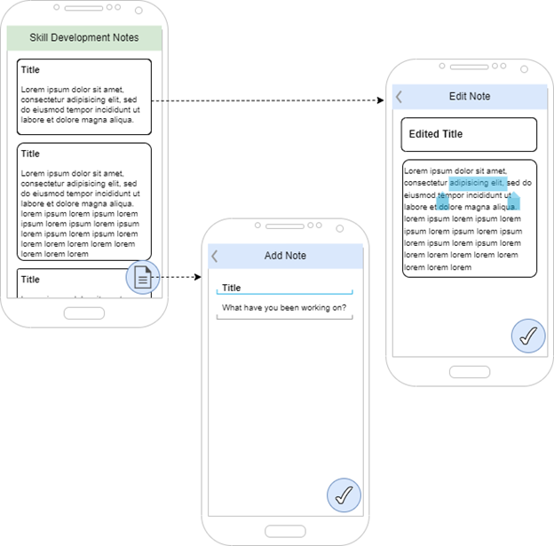

# SkillsDevelopment

<!-- PROJECT LOGO -->
<br />
<h3 align="center">Skill Development</h3>

  <p align="center">
    Skills Development note application - GCU final project
    <br />
    <a href="https://github.com/katonbingham/SkillsDevelopment"><strong>Explore the docs »</strong></a>
    <br />
    <br />
    <a href="TODO youtube link">View Demo</a>
  </p>
</div>

<!-- TABLE OF CONTENTS -->
<details>
  <summary>Table of Contents</summary>
  <ol>
    <li>
      <a href="#about-the-project">About The Project</a>
      <ul>
        <li><a href="#code-snippets">Code Snippets</a></li>
        <li><a href="#built-with">Built With</a></li>
      </ul>
    </li>
    <li><a href="#author">Author</a></li>
    <li><a href="#disclaimer">Disclaimer</a></li>

  </ol>
</details>

<!-- ABOUT THE PROJECT -->
## About The Project
This project aims to fill a niche for fitness applications that targets a user doing non-traditional training. The market is flush with apps that cater to the barbell lifting, known rep scheme, distance running, defined several week training cycle users. For individuals who want to train a technical sport that doesn’t necessarily benefit from a strength-building progressive overload approach, this application gives the flexibility to schedule training like workouts, but the actual training is unstructured enough to give freedom to the user.

<div align="center">
  
  
  
</div>

## Code Snippets

Flutter Card
```
body: FutureBuilder(
/*  */
child: Card(
  child: ListTile(
    contentPadding: const EdgeInsets.all(8.0),
    title: Text(snapshot.data![index].title),
    subtitle: Text(snapshot.data![index].body),
  ),
),
```

Database query
```
"CREATE TABLE notes ("
        "id INTEGER PRIMARY KEY, "
        "title TEXT, "
        "body TEXT, "
        "origin DATETIME)"
```

### Built With

* [Flutter](https://flutter.dev)
* [Dart](https://dart.dev)
* [SQLite](https://www.sqlite.org/index.html)

<p align="right">(<a href="#top">back to top</a>)</p>

<!-- AUTHOR -->
## Author

Katon Bingham - [@expensive.noise](https://www.instagram.com/expensive.noise/)

Project Link: [https://github.com/katonbingham/SkillsDevelopment](https://github.com/katonbingham/SkillsDevelopment)

<!-- DISCLAIMER -->
## Disclaimer

This project is in early, early alpha. The intent is to continue development of this project until it is useful as an actual training journal for a variety of people, especially in contrast to commonly available note taking applications. 

<p align="right">(<a href="#top">back to top</a>)</p>
